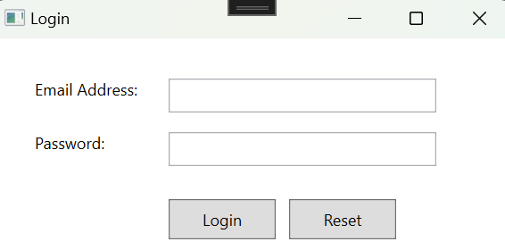

# Anmeldeanwendung in C# (WPF)

Dieses Projekt ist ein einfaches Anmeldeformular, das mit C# und WPF (Windows Presentation Foundation) erstellt wurde. Es ermöglicht dem Benutzer, eine E-Mail-Adresse und ein Passwort einzugeben, und bietet die Möglichkeit, sich anzumelden oder das Formular zurückzusetzen. Die Anwendung überprüft die eingegebenen Anmeldedaten und zeigt je nach Ergebnis entweder eine Erfolgsmeldung oder eine Fehlermeldung an.

## Funktionen
- **Eingabefeld für E-Mail-Adresse**: Der Benutzer kann seine E-Mail-Adresse eingeben.
- **Eingabefeld für Passwort**: Der Benutzer kann sein Passwort eingeben.
- **Anmelde-Button**: Überprüft die Anmeldedaten des Benutzers.
- **Zurücksetzen-Button**: Setzt die Eingabefelder zurück.

## Gültige Anmeldedaten
Um sich erfolgreich anzumelden, müssen die folgenden Anmeldedaten eingegeben werden:
- **E-Mail-Adresse**: `vmadmin@stud.gibb.ch`
- **Passwort**: `sml12345`

Wenn der Benutzer die korrekten Anmeldedaten eingibt, wird eine Erfolgsmeldung angezeigt. Andernfalls wird eine Fehlermeldung eingeblendet.

## Screenshots

### Anmeldebildschirm

## Funktionsweise

### Event-Handler:
1. **Textänderungsereignisse**: Überwacht Änderungen in den Eingabefeldern für E-Mail-Adresse und Passwort.
2. **Anmelde-Button-Klick**: Dieses Ereignis überprüft, ob die eingegebenen E-Mail-Adresse und das Passwort mit den gültigen Anmeldedaten übereinstimmen. Bei korrekten Daten wird eine Erfolgsmeldung angezeigt, andernfalls erscheint eine Fehlermeldung.
3. **Zurücksetzen-Button-Klick**: Setzt beide Eingabefelder zurück, damit der Benutzer die Anmeldedaten neu eingeben kann.

### Fehlerbehandlung:
Falls der Benutzer ungültige Anmeldedaten eingibt (d. h. etwas anderes als `vmadmin@stud.gibb.ch` als E-Mail und `sml12345` als Passwort), wird eine Fehlermeldung angezeigt, die besagt, dass der Anmeldeversuch fehlgeschlagen ist.

### Erfolgreiche Anmeldung:
Wenn die E-Mail-Adresse und das Passwort korrekt sind, wird eine Erfolgsmeldung angezeigt, die den Benutzer über die erfolgreiche Anmeldung informiert.

## So wird das Projekt ausgeführt
1. Klonen Sie das Repository oder laden Sie die Projektdateien herunter.
2. Öffnen Sie die Lösungsdatei in Visual Studio.
3. Bauen und starten Sie die Anwendung.
4. Testen Sie die Anmeldung, indem Sie die richtigen oder falschen Anmeldedaten eingeben.

## Verwendete Technologien
- **C#**: Programmiersprache.
- **WPF (Windows Presentation Foundation)**: Wird für die Gestaltung der Benutzeroberfläche verwendet.
